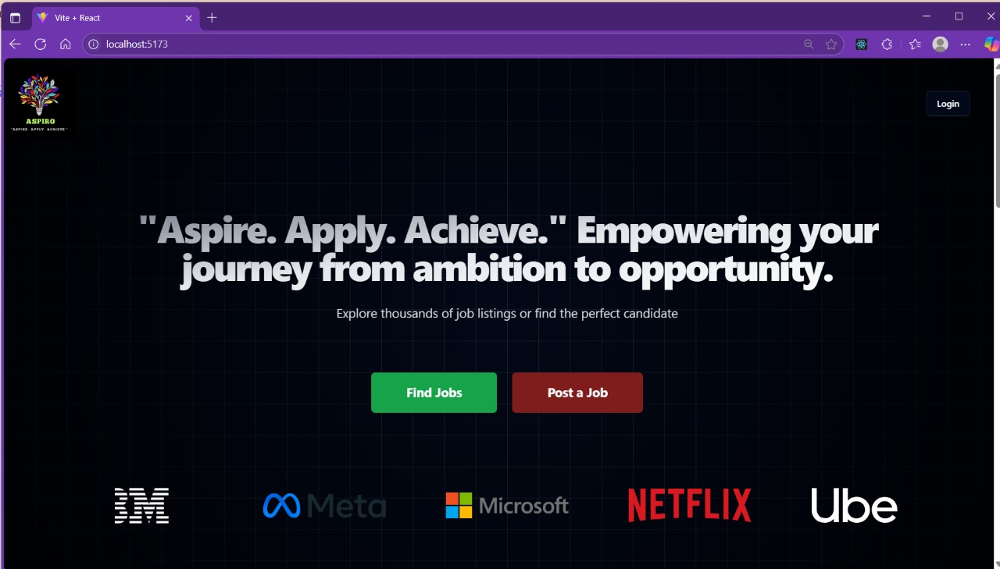
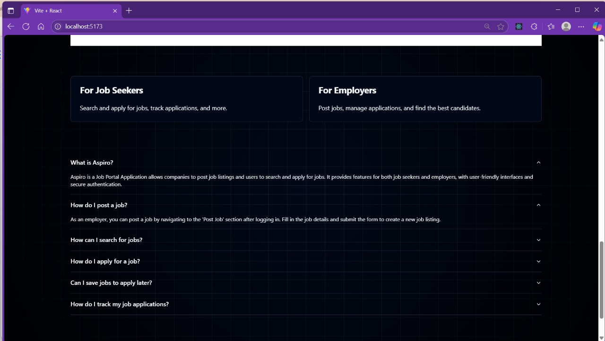
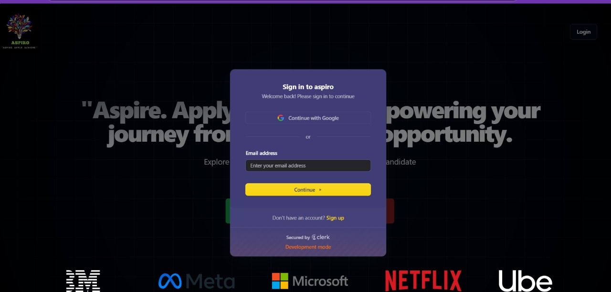
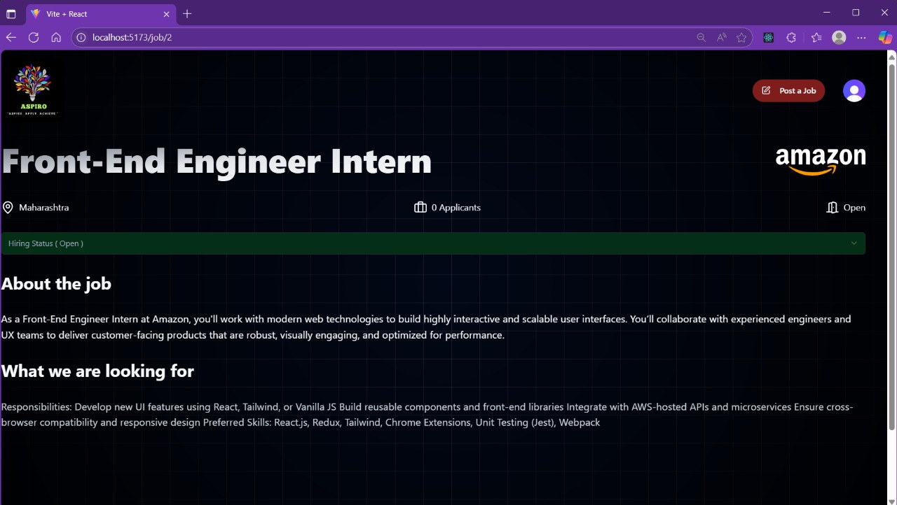
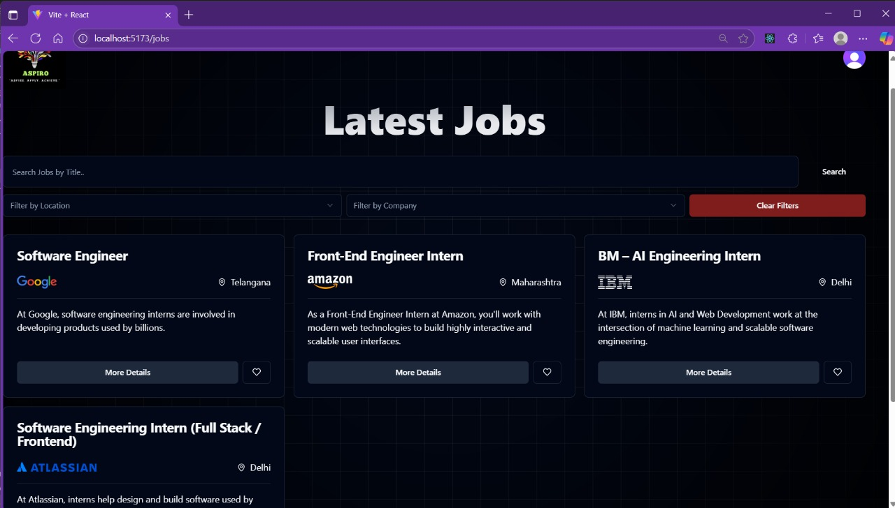
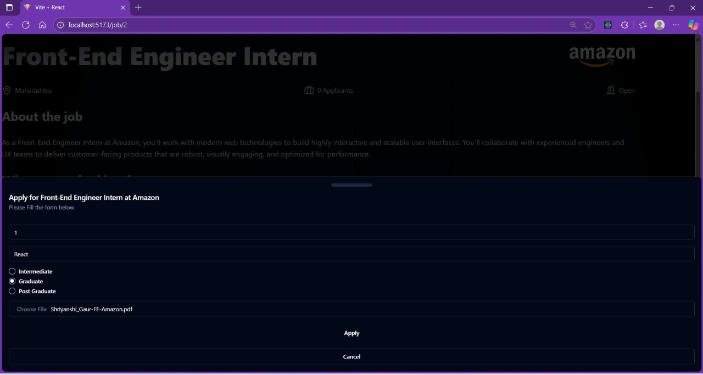
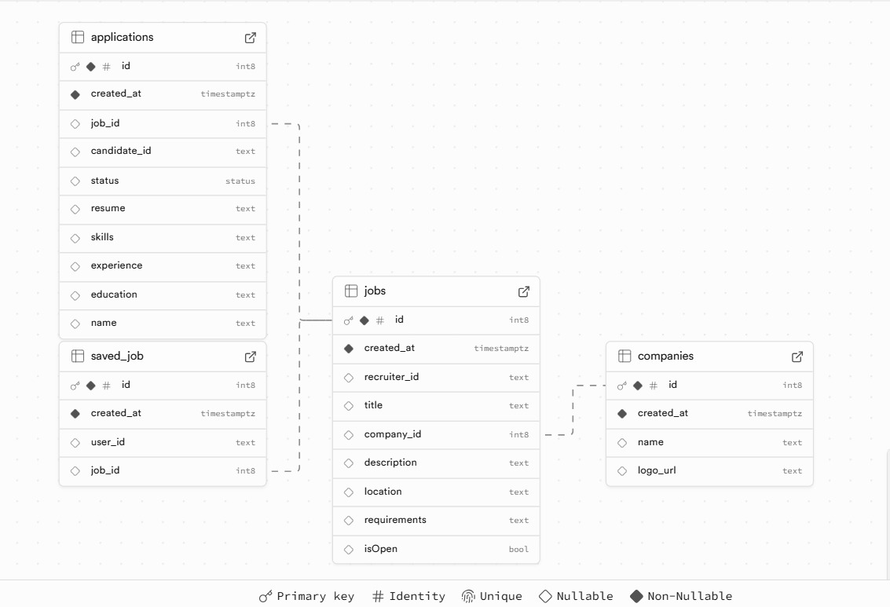

---

### 💼 **Aspiro** – Smart Job Discovery & Recruitment Platform   (Smart SaaS Job Portal )
**Tagline:** *"Aspire.Apply.Achieve".
Aspiro is a full-stack SaaS application built to optimize the job search and hiring experience for both job seekers and employers. With robust authentication, real-time resume tracking, and intuitive dashboards, Aspiro offers a dynamic and responsive platform tailored for modern hiring needs."*

**Overview:**  
Aspiro is a full-stack SaaS application built to optimize the job search and hiring experience for both job seekers and employers. With robust authentication, real-time resume tracking, and intuitive dashboards, Aspiro offers a dynamic and responsive platform tailored for modern hiring needs.

**🔑 Core Features:**
- **Authentication & Access Control**: Powered by Clerk with role-based experiences for job seekers and recruiters  
- **Personalized Dashboards**: Track applications, posted jobs, and saved listings  
- **Resume Upload & Management**: Securely store and retrieve documents via Supabase  
- **Dynamic Job Listings**: Interactive job cards with smart filtering and detail views  
- **Elegant UI/UX**: Built with shadcn/ui for accessible, customizable components  
- **Robust Validation**: Zod-based form validation for type-safe, scalable input handling

## 🖼️ Screenshots

 | 
 | 
 |
 |
 |
 |
 

**🛠️ Tech Stack:**
| Category          | Tools/Tech                                             |
|------------------|--------------------------------------------------------|
| **Frontend**      | React + Vite                                           |
| **Styling**       | shadcn/ui, TailwindCSS                     |
| **Routing**       | React Router                                           |
| **Auth**          | Clerk                                                  |
| **Backend**       | Supabase (PostgreSQL + Realtime)                       |
| **Validation**    | Zod                                                    |

**🌟 Bonus Highlights:**
- Accessible, mobile-first design  
- Modular and scalable codebase  
- Serverless architecture for speed and flexibility

> “Designed with precision, crafted for impact — by Shriyanshi Gaur.”

---
